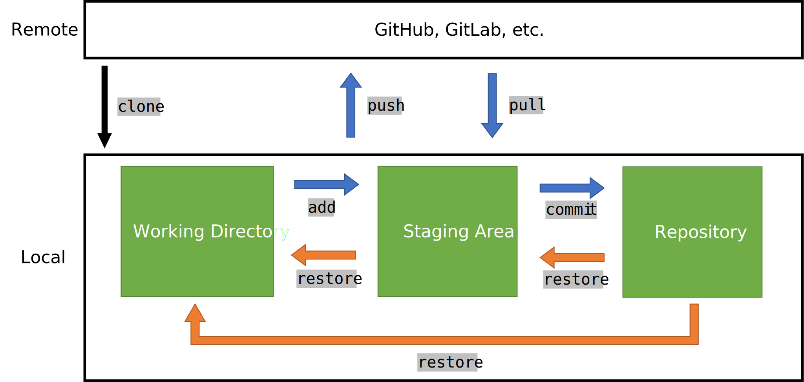

# Notes for Git
#### 2024/12/9 Potumas Liu
(git-bash.exe to open git bash via cmd)

### Basic Concepts
Git is a distributed version control system mainly for: 
- Tracking project history: stores *snapshots* of files within the directory so they can be restored to previous states easily.
- Cooperateive development: enables multiple users to develop the same project in an organized and efficient manner.

Command Line is the fastest and easiest way to develop with git. Some GUI tools such as Vscode gitlens, GitKraken, Sourcetree, etc. may come handy in certain situations, but they have limitations and are not always available. The following note focuses on using the command line.

The graph below demonstrates the main idea of using git. The nouns represent *git areas*, and the ```verbs``` represent *actions* by the user.
<div style="text-align: center;">

</div>

#### Git Areas 
- Local: the user's machine (PC, laptop, etc.)
    - Working Directory: where scripts are stored and edited.
    - Staging Area: stores files from the working directory temporarily.
    - Repository: where previous snapshots of the working directory are stored.
- Remote: the remote directory (the online *codebase*, such as GitHub, GitLab, etc.).

#### Actions 
- ```add``` stores a snapshot of specified files from the working directory in the staging area and make git track modifications of the files.
- ```commit``` stores a snapshot of the **staging area** in the repository. 
    - Usually happens when the user reaches a specific state while developing. If there are multiple problems to address, commit once when each problem is resolved. Always make commit messages meaningful. 
- ```restore``` converts scripts in the working directory or the staging area back to the state of a specific snapshot.
- ```push``` uploads **all new snapshots** from local repository to remote. This makes the remote directory contain all files of the latest snapshot.
- ```pull``` downloads and stores **all new snapshots** (probably pushed by other users) from remote.
- ```clone``` downloads the entire remote directory, including the working directory, staging area and the repository.

There are many more actions that can be taken in git with different parameters and flags specified. Execute the following command for additional information and instructions:
```bash
git config --help  # opens a webpage for detailed information for 'git config'
git config -h      # displays brief instructions for 'git config' in console
```

### Setup Git
1. Download and install Git from: https://git-scm.com/
1. Make sure git is added to PATH (for windows, usually add ```C:\Program Files\Git\cmd```)
    * Execute ```git -v``` in console. If git is properly installed, it will display its version, such as ```git version 2.47.1.windows.1```. Alternatively, execute ```git``` and see if instructions of git commands pop out.
1. Setup git configurations
    1. Open a console or Git Bash (click the 'Git Bash' icon or execute ```git-bash``` in console)
    1. Specify user name and email
        ```bash
        git config --global user.name <username>
        git config --global user.email <useremail>
        ```
    1. Set default editor
        ```bash
        git config --global core.editor “code --wait" 
        # only if 'code' (VScode) was already added to PATH 
        # '--wait' puts the console on hold while a file is being edited when using git
        ```
    1. End of line (EOF) settings
        ```bash
        git config --global core.autocrlf true  # Windows: true, Liunx: input
        ```
    * To directly edit the global configuration file, execute the following command:
        ```bash
        git config --global -e  # edit global configurations by default editor
        ```
### A Comprehensive Example to Begin with
Below, an example is provided to understand how git works. This is merely a small example, but it should help grasp the main idea of git.

#### 1. Initialize git in a directory
Starting from scratch, you must initialize a directory for git to work.
- Enter a directory 
    ```bash
    cd <your working directory>
    ```
- Initialize git in the directory. A ```.git``` folder will be created, where the staging area and the repository is implemented. **DO NOT TOUCH IT!!!**
    ```bash
    git init  # execute 'ls -a' to see all (hidden) files
    ``` 
Alternatively, ```clone``` a remote directory in the current working directory. Note that git is working **within** the directory that have been cloned, not the current working directory.
```bash
git clone <remote_url>  
```

#### 2. Create and edit some files
```bash
echo hello > file1.txt
echo hello > file2.txt
# ... do your work
```

#### 3. Add files to the staging area
* Store a snapshot in the staging area (patterns can be used)
    ```bash
    git add main.py log.txt  # store and track specified files
    git add *.txt            # store and track every file that ends with '.txt'
    git add .                # store and track everything in the directory
    ```
    Note that all modifications should be updated into the staging area by ```add```, including file deletion.

* Check the status of the staging area
    ```bash
    git status
    git status -s   # shorter output
    ```

#### 4. Commit from the staging area
* ```commit``` files in the staging area, record commit messages (can't be empty!), and store commit time, author, and snapshot ID.
    ```bash
    git commit -m "Initial commit."
    ```
    Alternatively, you can write down commit messages by the default editor
    ```bash
    git commit 
    ```
    It is not required to ```add``` files before ```commit```, but it is recommanded to do so. Only ```commit``` directly when you know what you are doing. This will ```add``` and ```commit``` files that are being tracked by git (exists in the staging area) at once.
    ```bash
    git commit -am "I know what I am doing."  # commit without adding first!
    ```

#### 5. Push commits to remote
After certain modifications, one would like to push its work to remote.
* Specify the remote url as 'origin'
    ```bash
    git remote add origin https://example_remote_url  # set the url as 'origin'
    git remote -v   # displays all remote 
    ```
    ```origin``` will represent the remote address later on. Multiple remote directories can be set. Execute ```git config -e``` to add remote directories by editing the configuration file for this directory.

* Rename the current branch. Git only pushes the same branch from local to remote. By default, you will be editing files on the 'master' branch in your working directory. However, the remote branch name will usually be 'main' (or other names), so you must make sure they share the same branch name.
    ```bash
    git branch -ls      # display all local branches and which one you are on
    git branch -M main  # rename the current branch as 'main'
    ```

* Push all new commits to remote. For the first time, you must execute:
    ```bash
    git push -u origin main  # for the first time
    # '-u' to set the remote directory to push (the upstream)
    ```
    You can simply execute ```git push``` to push to the same remote directory later on.


### Different Scenarios
#### File removal/rename
If a file is deleted from the working directory, the modification should be added to the staging area:
```bash
rm file.txt
git ls-files       # show files in the staging area
git add file.txt  # ‘add’ removed files to the staging area
```
Alternatively, we can remove the file from both the working directory and the staging at once:
```bash
git rm file.txt 
```
The same goes for renaming files. Note that we must ```add``` both the deleted file and the newly created file.
```bash
mv file1.txt main.js      # rename 'file1.txt' as 'main.js'
git status                # get 'delete file1.txt, and newfile main.js'
git add file1.txt main.js 
git mv main.js main.py  # rename 'main.js' as 'main.py' and add both files 
```

#### Files we don't want to commit
It does not make sense to commit some files, such as log files, personal local settings, etc. We can specify files (or subdirectories) that should not be committed in the ```.gitignore``` file.
```bash
mkdir logs, echo hello > logs/dev.log  # logs/ for the directory
echo logs/ > .gitignore  # can also use patterns, e.g. *.log
git add .gitignore  # must be added to the staging area as well
git commit -m "Ignore some files."
```
You MUST specify a file in .gitignore before adding it into the staging area, otherwise git will keep tracking it, even if you added it into .gitignore afterwards.
To stop tracking a file (or a subdirectory), we must remove it from the staging area.
```bash
git rm --cached -r "file"
```
Visit Github/gitignore for ```.gitignore``` templates for different programming languages.

#### Status of the staging area
Execute ```git status``` or ```git status -s``` to get the status of the staging area as follows:
```bash
$ git status -s
M  file1.js
 M file2.js
AM file3.js   # 'A' is green, 'M' is red
?? file4.js
D  file5.js
```
Each color and symbol represents the following meaning:
- Red (right letter): changes are not added to the staging area.
- Green (left letter): changes are added to the staging area, but not in the latest commit.
- M: the file is modified.
- A: the file is newly created and already added to the staging area.
- ??: the file is not in the staging area (not tracked by git, which can only be red).
- D: the file was deleted.

Notes:
- Everything in the staging area are up-to-date if all symbols are green.
        
#### Reivew/Compare your files before committing
It is recommanded to review changes in your files before committing.  The following commands display all differences:
```bash
git diff            # working directory vs. the staging area
git diff --staged   # the staging area vs. the latest commit
```
An example of result is as follows:
```git
$ git diff --staged
diff --git a/file1.js b/file1.js   # compare a with b 
index b2b9cc9..17f9c9c 100644
--- a/file1.js                     # ---: previous state of the file
+++ b/file1.js                     # +++: new state of the file
@@ -1,2 +1,4 @@                    # -: old copy, +: new copy
 hello                             
 test                              # 'hello\ntest' exists in both states
-ocean                             # deleted lines
+sky                               # added lines
```
It is often more convenient to review file differences by an IDE. To do so, we must first set the IDE as the 'difftool', and use it in the same way as ```diff```. Below is an example for using VScode, given it is properly installed and added to PATH.
```bash
git config --global diff.tool vscode  # 'vscode' is just a name, can be set arbitararily
git config --global difftool.vscode.cmd “code --wait --diff $LOCAL $REMOTE” 
# '--diff': to compare file differences 
# may have to manually setup '$LOCAL $REMOTE' via 'git config --global -e'
git difftool            # vscode should pop out
git difftool --staged
```

#### View commit history
As a version control system, git stores previous snapshots of the tracked files. We may want to view these previous versions occationally. 
- Display information of all commits:
    ```bash
    git log
    git log --oneline            # display only a short summary of each commit
    git log --oneline --reverse  # reverse the display order
    ```

- Display detailed changes made by a commit by specifying its ID or referencing the HEAD pointer (use ```git log --oneline``` to see which commit HEAD is pointing at):
    ```bash
    git show 925bs45  # shows differences made in commit '925bs45'
    git show HEAD     # shows differences made in the 'HEAD' commit
    git show HEAD~2   # shows differences made in the second commit prior to 'HEAD'
    ```
- Display the entire file of a commit:
    ```bash
    git show 925bs45:file.txt  # display 'file.txt' of commit '925bs45'
    git show HEAD~1:file.txt   # display 'file.txt' of the commit prior to 'HEAD'
    ```
- Display everything in a commit. 'blob' represents files, and 'tree' represents directories.
    ```bash
    git ls-tree HEAD~1  # list all files and directories 
    ```

#### Restore files
We can discard or undo changes of files that are tracked by git. By default, files in the staging area will be restored from the latest commit, and files in the working directory will be restored from the staging area. We must specify ```--source``` to restore from a previous commit.
- Restore files in the working directory from the staging area:
    ```bash
    # replace 'main.py' in the working directory by that in the staging area
    git restore main.py  
    ```
    If a file in the working directory does not exist in the staging area, it will not be replaced or removed. We must ```clean``` untracked files from the working directory manually.
    ```bash
    git clean -fd  # '-fd' forces git to clean a directory as well
    ```

- Restore files in the staging area from the latest commit:
    ```bash
    # replace 'file1.js' and 'file2.js' in the staging area by that of the latest commit
    git restore --staged file1.js file2.js
    ```
    Files that do not exist in the latest commit will be removed from the staging area.

- Restore files in the working directory from a previous commit:
    ```bash
    git restore --source=925bs45 file1.js
    git restore --source=HEAD~1 file1.js
    ```

#### Editing files on a separate branch
When using git, we are always editing files on a *branch* (the default branch at local is 'master', while the default branch at GitHub is 'main'). In practice, branches are used when we want to modify files in the directory but does not want to replace the original code before the changes are confirmed to be solid. This usually happens when you are developing with a team, and may also come in handy when fixing a bug or adding a new feature.
```bash
git branch -l  # list all branches, and show which one you are currently on
git branch newBranch    # creates a new branch
git checkout newBranch  # go to 'newBranch'
git branch -b newBranch  # creates and go to a new branch
git branch -l
```
We can also rename the current branch:
```bash
git branch -M newBranch  # rename the current branch as newBranch
```
We can ```merge``` with the other branch when we want to apply changes:
```bash
git checkout main
git merge newBranch  # merge commits of 'newBranch' to the 'main' branch
```
We can also check the differences between branches:
```bash
git diff branch_1 branch_2  # compare the latest commit of branch_2 to branch_1 
# here, branch_1 is viewed as the older version
```
The above command compares differences in the latest **commit** of the two branches. If you modify branch_1 but did not commit, git will recognize the two branches as identical.
Use the following command to check if the current branch is up-to-date:
```bash
git status -b  # show branch information
```
We can delete branches with the following command:
```bash
git branch -d useless_branch   # '-df' to delete the branch anyway
```

#### Pull updates from remote
When a branch in the remote directory is updated, you can ```pull``` the new commits:
```bash
git pull   # update the local branch from remote
```

#### Push to a different remote branch
By default, git pushes the same branch from local to remote. If you are in the main branch and tries to push to remote branch_1 by ```git push -u origin branch_1```, git will tell you everything is up-to-date since local branch_1 remains the same.
To push from a different local branch, use the following command:
```bash
git push origin branch_1:branch_2   # pushes local 'branch_1' to remote 'branch_2'
```
Note that this will not affect local branch_2. In fact, when switching to branch_2 later on, git will inform you that branch_2 was updated in remote.

#### Stop using git in a directory
To stop git from tracking a directory, we can simply delete the ```.git``` directory:
```bash
rm -rf .git
```

### Do not put the git directory inside a cloud drive directory!


#### Large file storage (LFS)
#### Install LFS (for linux ubuntu)
1. Update the system, install and initialize git-lfs
    ```bash
    sudo apt-get update
    sudo apt-get install git  # if git is not installed
    sudo apt-get install git-lfs
    git lfs install   # must execute under each user account once
    ```
1. Track large files by git-lfs
    ```bash
    cd /path/to/directory
    git lfs track "*.bz2"
    git lfs track "training_data/*"  # track everything within the folder
    # ... everything you want to track by git-lfs
    git add .gitattributes
    git commit -m "Initialized Git-LFS"
    ```
    Note that you should not ```add``` a large file to the staging area before tracking it by git-lfs

You can now use git normally as usual.

#### Untrack by LFS
1. Remove the file from ```.gitattributes```
1. ```bash
   git lfs untrack file.txt
   git rm --cached file.txt
   git add file.txt
   ```

#### Undo a commit
```bash
git reset --soft HEAD~1
```
#### fetch
```bash
git fetch --all
git fetch origin/main
```

#### tags
```bash
git tag -am "<msg>" tagname
```

# merge
* tortoise git branch tool (for windows, visualization tool)
* Each branch is meant to merge with the main branch eventually
* Source branch: the branch with new code you want to apply (unchanged, usually feature/debug); Target branch: the branch you want to update (will be changed, usually main)
* Merge when you are in the target branch
* undo a merge
* merge conflicts 


#### tags
#### merge
#### reset commit


### References
